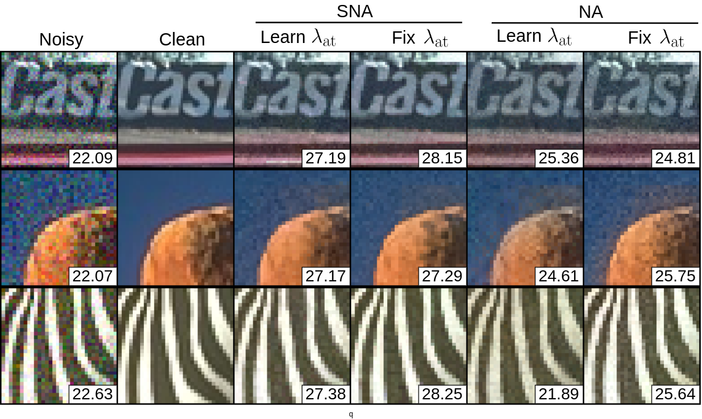

# Superpixel Neighborhood Attention (SNA)

Superpixel Neighborhood Attention (SNA) is a novel approach to image denoising that addresses the limitations of traditional attention operators, which operate on square windows and can mix features from perceptually unrelated regions. This can degrade the quality of the denoising process. SNA uses superpixel probabilities to interpolate between existing neighborhood attention and naive superpixel neighborhood attention, leading to improved denoising performance.


## Overview

Images often contain objects with deformable boundaries, such as the contours of a human face. Traditional attention operators act on square windows, which can mix features from unrelated regions and degrade the quality of a denoiser. While one can exclude pixels using an estimate of perceptual groupings like superpixels, naive use of superpixels can be theoretically and empirically worse than standard attention.

This paper proposes **Soft Superpixel Neighborhood Attention (SNA)**, which uses superpixel probabilities rather than superpixel assignments. This method interpolates between existing neighborhood attention and naive superpixel neighborhood attention, presenting theoretical results that show SNA is the optimal denoiser under a latent superpixel model.

SNA outperforms alternative local attention modules on image denoising, and we compare the superpixels learned from denoising with those learned with superpixel supervision.

## Installation

To install and use the Superpixel Neighborhood Attention module, follow these steps:

1. Clone the repository:
    ```bash
    git clone https://github.com/gauenk/spix_paper.git
    cd spix_paper
    ```

2. Install the required dependencies:
    ```bash
    pip install -r requirements.txt
    ```

## Usage

To use SNA in your image denoising tasks, you can follow the example below:

```python
from torchvision.utils import save_image
from spix_paper.spix_utils import run_slic
from spix_paper.attn import SuperpixelAttention

# -- create superpixels --
sims = run_slic(noisy_sp, sp_stride, sp_niters, sp_m, sp_scale, grad_type)[1]

# -- create attention module --
model = SuperpixelAttention(nftrs,normz_patch=normz,
                            kernel_size=ksize,attn_type=attn_type,
                            dist_type=dist_type,qk_scale=scale,
                            proj_layer=False)
# -- id weights --
with th.no_grad():
    model.nat_attn.qk.weight[:3,:] = th.eye(nftrs)
    model.nat_attn.qk.weight[-3:,:] = th.eye(nftrs)
    model.nat_agg.v.weight[...] = th.eye(nftrs)

# -- Load your image and preprocess if necessary --
image = load_image('path/to/your/image')

# -- Apply Superpixel Neighborhood Attention for denoising --
denoised_image = model(image)

# Save or display the denoised image
save_image(denoised_image, 'path/to/save/denoised_image')
```


## Denoising Results


The following images demonstrate the performance of Superpixel Neighborhood Attention compared to Neighborhood Attention and Hard Superpixel Neighborhood Attention.



## Superpixel Attention Map

The following images compare the attention maps of SNA with alternatives.


## Citation

If you find this work useful, please cite our paper:

```bibtex
@inproceedings{gauen2024sna,
  title={Soft Superpixel Neighborhood Attention},
  author={Gauen, Kent and Chan, Stanley},
  journal={arXiv},
  year={2024}
}

